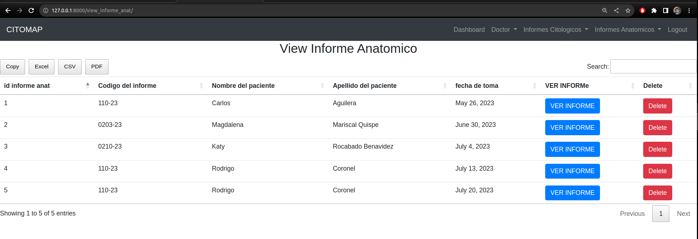

# CITOMAP

CITOMAP is a private site for a medical insitution (called citomap) where doctors can save their patients data and make reports of the diagnosis they make based on the anatomic pathology examination. This part only contains the backend part.

It was done using Django. The doctors can register patients and make their reports using forms in the pageweb and then generating a pdf ready to be sent to other doctors.

## Installation

The Code is written in Python 3.8.0. If you don't have Python installed you can find it [here](https://www.python.org/downloads/). If you are using a lower version of Python you can upgrade using the pip package, ensuring you have the latest version of pip. To install the required packages and libraries, run this command in the project directory after cloning the repository

python manage.py migrate

python manage.py makemigrations

python manage.py runserver

In your web browser enter the address : [http://localhost:8000](http://localhost:8000) or [http://127.0.0.1:8000/](http://127.0.0.1:8000/)

## Running

Login

Forms

Patients 

Report

## Dependencies

Some important dependencies

[Reportlab](https://docs.djangoproject.com/en/5.0/howto/outputting-pdf/)
